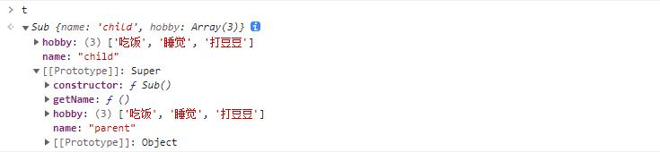

# 继承

## 原型继承

构造函数、原型和实例之间的关系：每个构造函数都有一个原型对象，原型对象都包含一个指向构造函数的指针，而实例都包含一个原型对象的指针。

实现：

```js
function Super () {
  this.name = "parent"
}
Super.prototype.say = function () {
  console.log("hello!")
}

function Sub () {}
// 创建 Super 的实例，并将该实例赋值 Sub.prototype
Sub.prototype = new Super()

const test = new Sub()
console.log(test.say()) // hello!
```

缺点：多个实例对引用类型的操作会被篡改

## 借用构造函数继承

使用父类的构造函数来增强子类实例，等同于复制父类的实例给子类（不使用原型），每个实例都会有自己的属性，哪怕是引用值也不会被污染

实现

```js
function Super () {
  this.hobby = ["吃饭", "睡觉", "打豆豆"]
}
Super.prototype.say = function () {
  console.log("hello!")
}

function Sub () {
  // 继承 Super
  Super.call(this)
}

const test = new Sub()
test.hobby.push("卷前端")
console.log(test.hobby) // ["吃饭", "睡觉", "打豆豆", "卷前端"]
test.say() //Uncaught TypeError: test.say is not a function
const test1 = new Super()
console.log(test1.hobby) // ["吃饭", "睡觉", "打豆豆"]
```

缺点：
1. 只能继承父类得实例和方法，不能继承原型上的属性和方法
2. 无法复用，每个子类都有父类实例函数的副本，影响性能

## 组合继承（原型继承+构造函数继承）

组合上述两种方法就是组合继承。用原型链实现对原型属性和方法的继承，用借用构造函数技术来实现实例属性的继承。

实现：

```js
function Super () {
  this.name = "parent"
  this.hobby = ["吃饭", "睡觉", "打豆豆"]
}
Super.prototype.say = function () {
  console.log("hello!")
}

function Sub () {
  // 继承 Super
  Super.call(this)
  this.name = "child"
}
// 继承原型链
Sub.prototype = new Super()
// Sub.prototype 的 constructor 属性，指向自己的构造函数 Sub
Sub.prototype.constructor = Sub
Sub.prototype.getName = function () {
  console.log(this.name)
}

const t = new Sub()
```



可以看到实例对象 `t` 上的两个属性与原型对象上属性重名，并且会覆盖

缺点：
组合模式的缺点就是在使用子类创建实例对象时，其原型中会存在两份相同的属性/方法。